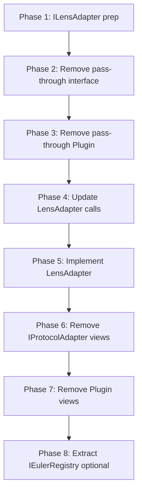

# EulerV2Plugin Bytecode Reduction - Implementation Guide

**Project:** Project4  
**Date:** January 31, 2026  
**Objective:** Reduce EulerV2Plugin from 31632 bytes to ~20000 bytes (target: <24576)  
**Method:** Move view functions to LensAdapter + Remove pass-through getters  
**Expected Savings:** ~11632 bytes  

---

## Table of Contents

1. [Quick Reference](#quick-reference)
2. [Architecture Overview](#architecture-overview)
3. [Implementation Phases](#implementation-phases)
4. [Phase 1: Prepare ILensAdapter](#phase-1-prepare-ilensadapter)
5. [Phase 2: Remove Pass-Through (Interface)](#phase-2-remove-pass-through-interface)
6. [Phase 3: Remove Pass-Through (Plugin)](#phase-3-remove-pass-through-plugin)
7. [Phase 4: Update LensAdapter Registry Calls](#phase-4-update-lensadapter-registry-calls)
8. [Phase 5: Implement LensAdapter Functions](#phase-5-implement-lensadapter-functions)
9. [Phase 6: Remove from IProtocolAdapter](#phase-6-remove-from-iprotocoladapter)
10. [Phase 7: Remove from Plugin](#phase-7-remove-from-plugin)
11. [Phase 8: Extract IEulerRegistry (Optional)](#phase-8-extract-ieulerregistry-optional)
12. [Testing Strategy](#testing-strategy)
13. [Rollback Plan](#rollback-plan)

---

## Quick Reference

### Files to Modify (7 total)

| File | Lines | Operations |
|------|-------|------------|
| `interfaces/ILensAdapter.sol` | ~150 | Add 9 function signatures |
| `interfaces/IEulerV2PluginSpecific.sol` | ~200 | Remove 3 pass-through functions + struct |
| `interfaces/IProtocolAdapter.sol` | ~300 | Remove 9 view function signatures |
| `plugins/EulerV2Plugin.sol` | 1902 | Remove 12 functions (pass-through + views) |
| `adapters/EulerLensAdapter.sol` | 1070 | Add 9 implementations + update 12 calls |
| `test/EulerV2Plugin.test.ts` | ~800 | Update 15+ test calls |
| `interfaces/IEulerRegistry.sol` | NEW | Extract Registry interface (optional) |

### Bytecode Impact

```
BEFORE:
├─ EulerV2Plugin: 31632 bytes (+28.7% over limit)
└─ EulerLensAdapter: ~5000 bytes

AFTER:
├─ EulerV2Plugin: ~20000 bytes (-36.8%, UNDER limit ✅)
└─ EulerLensAdapter: ~6300 bytes (+26%, still safe)

TOTAL SAVINGS: ~11632 bytes
```

### Phase Sequence

```
Phase 1: ILensAdapter (add signatures)           [30 min]
Phase 2: IEulerV2PluginSpecific (remove 3)       [15 min]
Phase 3: EulerV2Plugin (remove 3 impl)           [15 min]
Phase 4: EulerLensAdapter (update 12 calls)      [45 min]
Phase 5: EulerLensAdapter (implement 9)          [90 min]
Phase 6: IProtocolAdapter (remove 9)             [15 min]
Phase 7: EulerV2Plugin (remove 9 impl)           [30 min]
Phase 8: IEulerRegistry extraction (optional)    [60 min]

TOTAL: ~5 hours
```

---

## Architecture Overview

### Current Architecture (INEFFICIENT)

```
ProtocolManager
    │
    ├─ Write → EulerV2Plugin (31632 bytes ❌)
    │              ├─ deposit/withdraw/borrow/repay
    │              ├─ openLeverage/closeLeverage
    │              ├─ getTotalValue() ← WRONG (view in write contract)
    │              ├─ getHealthFactor() ← WRONG
    │              └─ getLeveragePosition() ← PASS-THROUGH WASTE
    │                      ↓
    │                  Registry.getPosition()
    │
    └─ Read → EulerLensAdapter (5000 bytes)
                   ├─ getCollateralValue()
                   ├─ getDebtValue()
                   └─ plugin.getLeveragePosition() ← 2 hops waste
```

### Target Architecture (EFFICIENT)

```
ProtocolManager
    │
    ├─ Write → EulerV2Plugin (~20000 bytes ✅)
    │              ├─ deposit/withdraw/borrow/repay
    │              ├─ openLeverage/closeLeverage
    │              ├─ flashLoanCallback()
    │              └─ getSubAccountAddress() (logic helper)
    │
    └─ Read → EulerLensAdapter (~6300 bytes ✅)
                   ├─ getTotalValue() ← MOVED HERE
                   ├─ getHealthFactor() ← MOVED HERE
                   ├─ getCollateralValue()
                   ├─ getDebtValue()
                   └─ Registry.getPosition() ← DIRECT (1 hop)
```

### What Stays in Plugin (19 functions)

| Category | Functions | Bytes |
|----------|-----------|-------|
| Write Operations | `deposit`, `withdraw`, `borrow`, `repay` | ~6000 |
| Leverage Operations | `openLeverageAtomic`, `closeLeverageAtomic`, `addCollateralToPosition`, `removeCollateralFromPosition`, `closePositionsForWeth` | ~8000 |
| Safety Checks | `canClosePosition`, `validateLeverageParams` | ~1500 |
| Protocol Info | `getProtocolName`, `getProtocolSummary`, `getSubAccountAddress` | ~800 |
| Flash Loan | `flashLoanCallback` + context | ~2500 |
| Helpers | `_getVaultRegistry`, `_executeSwap`, `_validateBorrow`, `_getProxy` | ~1200 |
| **TOTAL** | **19 functions** | **~20000** |

### What Moves to LensAdapter (9 functions)

| Function | Bytes | Reason |
|----------|-------|--------|
| `getTotalValue()` | ~400 | Pure read aggregation |
| `getValueBreakdown()` | ~450 | Pure read aggregation |
| `getHealthFactor()` | ~350 | Pure read calculation |
| `getMaxWithdrawable()` | ~400 | Pure read calculation |
| `getLiquidationThreshold()` | ~300 | Pure read calculation |
| `getPositionsSortedByRisk()` | ~500 | Pure read + sorting |
| `estimatePositionAfterSwap()` | ~400 | Pure read estimation |
| `getProtocolLimits()` | ~200 | Static data |
| `getTimeToLiquidation()` | ~400 | Pure read calculation |
| **TOTAL** | **~3400** | **View-only operations** |

### What Gets Removed (3 pass-through)

| Function | Bytes | Reason |
|----------|-------|--------|
| `getLeveragePosition()` | ~300 | Useless struct conversion |
| `getAllLeveragePositions()` | ~500 | Useless loop conversion |
| `nextPositionId()` | ~50 | Pure pass-through |
| **TOTAL** | **~850** | **Zero logic added** |

---

## Implementation Phases

### Phase Overview



---

## Phase 1: Prepare ILensAdapter

**Goal:** Add 9 new function signatures to `ILensAdapter`  
**File:** `contracts/interfaces/ILensAdapter.sol`  
**Time:** 30 minutes  
**Dependencies:** None  
**Breaking Changes:** None (only additions)

### Step 1.1: Add Function Signatures

**Location:** After existing functions in `ILensAdapter`

```solidity
// ============================================================================
// VIEW FUNCTIONS - Moved from IProtocolAdapter
// ============================================================================

/**
 * @notice Get total value of all protocol positions in ETH
 * @return totalValueEth Total value in ETH (18 decimals)
 */
function getTotalValue() external view returns (uint256 totalValueEth);

/**
 * @notice Get detailed value breakdown
 * @return totalCollateralEth Total collateral value in ETH
 * @return totalDebtEth Total debt value in ETH
 * @return netValueEth Net value (collateral - debt) in ETH
 */
function getValueBreakdown() 
    external 
    view 
    returns (
        uint256 totalCollateralEth,
        uint256 totalDebtEth,
        uint256 netValueEth
    );

/**
 * @notice Get health factor (collateral / debt ratio)
 * @return healthFactor Health factor (18 decimals, 1.5e18 = 150%)
 */
function getHealthFactor() external view returns (uint256 healthFactor);

/**
 * @notice Get maximum withdrawable amount without breaking health
 * @param tokenCode Token to withdraw
 * @return maxAmount Maximum withdrawable amount
 */
function getMaxWithdrawable(string memory tokenCode) 
    external 
    view 
    returns (uint256 maxAmount);

/**
 * @notice Get liquidation threshold for position
 * @param positionId Position ID
 * @return thresholdEth Liquidation threshold in ETH
 */
function getLiquidationThreshold(uint256 positionId) 
    external 
    view 
    returns (uint256 thresholdEth);

/**
 * @notice Get all positions sorted by risk (highest first)
 * @return positionIds Array of position IDs sorted by risk
 * @return riskScores Array of risk scores (18 decimals, higher = riskier)
 */
function getPositionsSortedByRisk() 
    external 
    view 
    returns (
        uint256[] memory positionIds,
        uint256[] memory riskScores
    );

/**
 * @notice Estimate position state after swap
 * @param positionId Position ID
 * @param tokenIn Token to swap from
 * @param tokenOut Token to swap to
 * @param amountIn Amount to swap
 * @return newCollateralEth New collateral value in ETH
 * @return newDebtEth New debt value in ETH
 * @return newHealthFactor New health factor
 */
function estimatePositionAfterSwap(
    uint256 positionId,
    address tokenIn,
    address tokenOut,
    uint256 amountIn
) 
    external 
    view 
    returns (
        uint256 newCollateralEth,
        uint256 newDebtEth,
        uint256 newHealthFactor
    );

/**
 * @notice Get protocol limits
 * @return minHealthFactor Minimum health factor (18 decimals)
 * @return maxLeverage Maximum leverage (100 = 1x, 300 = 3x)
 */
function getProtocolLimits() 
    external 
    view 
    returns (
        uint256 minHealthFactor,
        uint256 maxLeverage
    );

/**
 * @notice Estimate time until liquidation at current rates
 * @param positionId Position ID
 * @return timeSeconds Seconds until liquidation (0 = safe, type(uint256).max = never)
 */
function getTimeToLiquidation(uint256 positionId) 
    external 
    view 
    returns (uint256 timeSeconds);
```

### Step 1.2: Compile & Verify

```bash
npm run compile
```

**Expected:** ✅ Success (interface only, no implementations yet)

### Step 1.3: Commit

```bash
git add contracts/interfaces/ILensAdapter.sol
git commit -m "feat: add 9 view function signatures to ILensAdapter"
```

---

## Phase 2: Remove Pass-Through (Interface)

**Goal:** Remove 3 pass-through functions from `IEulerV2PluginSpecific`  
**File:** `contracts/interfaces/IEulerV2PluginSpecific.sol`  
**Time:** 15 minutes  
**Dependencies:** Phase 1 complete  
**Breaking Changes:** YES (Plugin will not compile)

### Step 2.1: Remove Struct

**Find and DELETE:**

```solidity
/**
 * @notice Internal representation of leverage position
 */
struct LeveragePositionInternal {
    uint256 positionId;
    uint8 subAccountId;
    address collateralVault;
    address borrowVault;
    uint256 initialCollateral;
    uint256 borrowedAmount;
    bool isActive;
    uint256 createdAt;
}
```

### Step 2.2: Remove Function Signatures

**Find and DELETE:**

```solidity
/**
 * @notice Get next position ID
 */
function nextPositionId() external view returns (uint256);

/**
 * @notice Get leverage position by ID
 */
function getLeveragePosition(uint256 positionId) 
    external 
    view 
    returns (LeveragePositionInternal memory);

/**
 * @notice Get all leverage positions
 */
function getAllLeveragePositions() 
    external 
    view 
    returns (LeveragePositionInternal[] memory);
```

### Step 2.3: Verify Remaining Functions

**KEEP these (write operations):**

```solidity
function openLeverageAtomic(...) external;
function closeLeverageAtomic(...) external;
function addCollateralToPosition(...) external;
function removeCollateralFromPosition(...) external;
function closePositionsForWeth(...) external;
function getSubAccountAddress(...) external view;  // Has logic
```

### Step 2.4: Compile

```bash
npm run compile
```

**Expected:** ❌ Errors in Plugin (implementations still present)  
**This is normal!** Phase 3 will fix it.

### Step 2.5: Commit

```bash
git add contracts/interfaces/IEulerV2PluginSpecific.sol
git commit -m "refactor: remove pass-through getters from IEulerV2PluginSpecific"
```

---

## Phase 3: Remove Pass-Through (Plugin)

**Goal:** Remove 3 pass-through implementations from `EulerV2Plugin`  
**File:** `contracts/plugins/EulerV2Plugin.sol`  
**Time:** 15 minutes  
**Dependencies:** Phase 2 complete  
**Breaking Changes:** YES (LensAdapter will not compile)

### Step 3.1: Remove nextPositionId()

**Find and DELETE (L1820-1825):**

```solidity
/// @inheritdoc IEulerV2PluginSpecific
function nextPositionId() external view override returns (uint256) {
    address registry = _getVaultRegistry();
    return IEulerVaultRegistry(registry).nextPositionId();
}
```

### Step 3.2: Remove getLeveragePosition()

**Find and DELETE (L1828-1844):**

```solidity
/// @inheritdoc IEulerV2PluginSpecific
function getLeveragePosition(uint256 positionId) 
    external 
    view 
    override 
    returns (IEulerV2PluginSpecific.LeveragePositionInternal memory position) 
{
    address registry = _getVaultRegistry();
    IEulerVaultRegistry.LeveragePositionStorage memory pos = 
        IEulerVaultRegistry(registry).getPosition(positionId);
    
    position = IEulerV2PluginSpecific.LeveragePositionInternal({
        positionId: positionId,
        subAccountId: pos.subAccountId,
        collateralVault: pos.collateralVault,
        borrowVault: pos.borrowVault,
        initialCollateral: pos.initialCollateral,
        borrowedAmount: pos.borrowedAmount,
        isActive: pos.isActive,
        createdAt: pos.createdAt
    });
}
```

### Step 3.3: Remove getAllLeveragePositions()

**Find and DELETE (L1847-1867):**

```solidity
/// @inheritdoc IEulerV2PluginSpecific
function getAllLeveragePositions() 
    external 
    view 
    override 
    returns (IEulerV2PluginSpecific.LeveragePositionInternal[] memory positions) 
{
    address registry = _getVaultRegistry();
    IEulerVaultRegistry.LeveragePositionStorage[] memory allPos = 
        IEulerVaultRegistry(registry).getAllPositions();
    
    positions = new IEulerV2PluginSpecific.LeveragePositionInternal[](allPos.length);
    for (uint256 i = 0; i < allPos.length; i++) {
        IEulerVaultRegistry.LeveragePositionStorage memory pos = allPos[i];
        positions[i] = IEulerV2PluginSpecific.LeveragePositionInternal({
            positionId: i,
            subAccountId: pos.subAccountId,
            collateralVault: pos.collateralVault,
            borrowVault: pos.borrowVault,
            initialCollateral: pos.initialCollateral,
            borrowedAmount: pos.borrowedAmount,
            isActive: pos.isActive,
            createdAt: pos.createdAt
        });
    }
}
```

### Step 3.4: Compile

```bash
npm run compile
```

**Expected:** 
- ✅ Plugin compiles
- ❌ LensAdapter has errors (calls removed functions)

### Step 3.5: Check Bytecode Reduction

```bash
npm run compile 2>&1 | grep "EulerV2Plugin"
```

**Expected:** Bytecode reduced by ~650-850 bytes

### Step 3.6: Commit

```bash
git add contracts/plugins/EulerV2Plugin.sol
git commit -m "refactor: remove pass-through getter implementations from Plugin"
```

---

## Phase 4: Update LensAdapter Registry Calls

**Goal:** Update 12 calls in LensAdapter to use Registry directly  
**File:** `contracts/adapters/EulerLensAdapter.sol`  
**Time:** 45 minutes  
**Dependencies:** Phase 3 complete  
**Breaking Changes:** YES (changes call pattern)

### Step 4.1: Add Helper Function

**Add after constructor:**

```solidity
// ============================================================================
// INTERNAL HELPERS
// ============================================================================

/**
 * @notice Get EulerRegistry address via Beacon
 * @return registry EulerRegistry address
 */
function _getRegistry() private view returns (address registry) {
    return IBeacon(beacon).getImplementation("EulerRegistry");
}
```

### Step 4.2: Add Import

**Add at top of file:**

```solidity
import "../interfaces/IEulerVaultRegistry.sol";
```

### Step 4.3: Update 12 Call Sites

#### Call Site 1 - L254: getCollateralValue()

**BEFORE:**
```solidity
function getCollateralValue(uint256 positionId) 
    external 
    view 
    override 
    returns (uint256 valueEth) 
{
    IEulerV2PluginView.LeveragePosition memory pos = 
        IEulerV2PluginView(address(plugin)).getLeveragePosition(positionId);
    
    // ... rest
}
```

**AFTER:**
```solidity
function getCollateralValue(uint256 positionId) 
    external 
    view 
    override 
    returns (uint256 valueEth) 
{
    address registry = _getRegistry();
    IEulerVaultRegistry.LeveragePositionStorage memory pos = 
        IEulerVaultRegistry(registry).getPosition(positionId);
    
    // ... rest
}
```

#### Call Site 2 - L357: getTotalPositionsValue()

**Pattern:** Replace `plugin.getAllLeveragePositions()` with `registry.getAllPositions()`

```solidity
// BEFORE
IEulerV2PluginView.LeveragePosition[] memory positions = 
    IEulerV2PluginView(address(plugin)).getAllLeveragePositions();

// AFTER
address registry = _getRegistry();
IEulerVaultRegistry.LeveragePositionStorage[] memory positions = 
    IEulerVaultRegistry(registry).getAllPositions();
```

#### Call Site 3 - L396: getDebtValue()

**Pattern:** Same as Call Site 1

```solidity
// BEFORE
IEulerV2PluginView.LeveragePosition memory pos = 
    IEulerV2PluginView(address(plugin)).getLeveragePosition(positionId);

// AFTER
address registry = _getRegistry();
IEulerVaultRegistry.LeveragePositionStorage memory pos = 
    IEulerVaultRegistry(registry).getPosition(positionId);
```

#### Call Sites 4-12: Remaining Updates

**Apply same pattern to:**

- L492: `hasAnyActivePositions()`
- L537: `getPositionValue()`
- L618: `getPositionsSortedByRisk()`
- L804: `getTimeToLiquidation()`
- L868: `estimateLiquidationPrice()`
- L889: `getPositionsAtRisk()` (loop)
- L926: `getPositionsAtRisk()` (loop)
- L974: `estimateWethFromClose()`

### Step 4.4: Compile & Verify

```bash
npm run compile
```

**Expected:** ✅ All files compile successfully

### Step 4.5: Commit

```bash
git add contracts/adapters/EulerLensAdapter.sol
git commit -m "refactor: call Registry directly instead of Plugin pass-through"
```

---

## Phase 5: Implement LensAdapter Functions

**Goal:** Implement 9 view functions in `EulerLensAdapter`  
**File:** `contracts/adapters/EulerLensAdapter.sol`  
**Time:** 90 minutes  
**Dependencies:** Phase 4 complete  
**Breaking Changes:** None (only additions)

### Step 5.1: getTotalValue()

**Add after existing functions:**

```solidity
/// @inheritdoc ILensAdapter
function getTotalValue() external view override returns (uint256 totalValueEth) {
    address registry = _getRegistry();
    IEulerVaultRegistry.LeveragePositionStorage[] memory positions = 
        IEulerVaultRegistry(registry).getAllPositions();
    
    for (uint256 i = 0; i < positions.length; i++) {
        if (!positions[i].isActive) continue;
        
        // Get collateral value
        address collateralToken = IEVault(positions[i].collateralVault).asset();
        uint256 collateralBalance = IEVault(positions[i].collateralVault)
            .balanceOf(IEulerV2PluginView(address(plugin)).getSubAccountAddress(positions[i].subAccountId));
        uint256 collateralValueEth = IValueCalculator(valueCalculator)
            .getValueInEth(collateralToken, collateralBalance);
        
        // Get debt value
        address borrowToken = IEVault(positions[i].borrowVault).asset();
        uint256 debtBalance = IEVault(positions[i].borrowVault)
            .debtOf(IEulerV2PluginView(address(plugin)).getSubAccountAddress(positions[i].subAccountId));
        uint256 debtValueEth = IValueCalculator(valueCalculator)
            .getValueInEth(borrowToken, debtBalance);
        
        // Net value
        totalValueEth += collateralValueEth > debtValueEth 
            ? collateralValueEth - debtValueEth 
            : 0;
    }
}
```

### Step 5.2: getValueBreakdown()

```solidity
/// @inheritdoc ILensAdapter
function getValueBreakdown() 
    external 
    view 
    override 
    returns (
        uint256 totalCollateralEth,
        uint256 totalDebtEth,
        uint256 netValueEth
    ) 
{
    address registry = _getRegistry();
    IEulerVaultRegistry.LeveragePositionStorage[] memory positions = 
        IEulerVaultRegistry(registry).getAllPositions();
    
    for (uint256 i = 0; i < positions.length; i++) {
        if (!positions[i].isActive) continue;
        
        // Collateral
        address collateralToken = IEVault(positions[i].collateralVault).asset();
        uint256 collateralBalance = IEVault(positions[i].collateralVault)
            .balanceOf(IEulerV2PluginView(address(plugin)).getSubAccountAddress(positions[i].subAccountId));
        totalCollateralEth += IValueCalculator(valueCalculator)
            .getValueInEth(collateralToken, collateralBalance);
        
        // Debt
        address borrowToken = IEVault(positions[i].borrowVault).asset();
        uint256 debtBalance = IEVault(positions[i].borrowVault)
            .debtOf(IEulerV2PluginView(address(plugin)).getSubAccountAddress(positions[i].subAccountId));
        totalDebtEth += IValueCalculator(valueCalculator)
            .getValueInEth(borrowToken, debtBalance);
    }
    
    netValueEth = totalCollateralEth > totalDebtEth 
        ? totalCollateralEth - totalDebtEth 
        : 0;
}
```

### Step 5.3: getHealthFactor()

```solidity
/// @inheritdoc ILensAdapter
function getHealthFactor() external view override returns (uint256 healthFactor) {
    (uint256 totalCollateralEth, uint256 totalDebtEth,) = this.getValueBreakdown();
    
    if (totalDebtEth == 0) {
        return type(uint256).max; // No debt = infinite health
    }
    
    // Health factor = (collateral * LTV) / debt
    // Assuming 80% LTV for simplification (should be vault-specific)
    uint256 adjustedCollateral = (totalCollateralEth * 80) / 100;
    healthFactor = (adjustedCollateral * 1e18) / totalDebtEth;
}
```

### Step 5.4: getMaxWithdrawable()

```solidity
/// @inheritdoc ILensAdapter
function getMaxWithdrawable(string memory tokenCode) 
    external 
    view 
    override 
    returns (uint256 maxAmount) 
{
    address registry = _getRegistry();
    address vault = IEulerVaultRegistry(registry).getVault(tokenCode);
    address token = IEVault(vault).asset();
    
    // Get current balance
    address subAccount = IEulerV2PluginView(address(plugin)).getSubAccountAddress(0);
    uint256 currentBalance = IEVault(vault).balanceOf(subAccount);
    
    // Get health factor impact
    uint256 currentHealth = this.getHealthFactor();
    
    // Binary search for max withdrawable maintaining MIN_HEALTH_FACTOR
    uint256 left = 0;
    uint256 right = currentBalance;
    
    while (left < right) {
        uint256 mid = (left + right + 1) / 2;
        
        // Simulate withdrawal
        uint256 valueToWithdraw = IValueCalculator(valueCalculator)
            .getValueInEth(token, mid);
        (uint256 totalCollateralEth, uint256 totalDebtEth,) = this.getValueBreakdown();
        
        uint256 newCollateral = totalCollateralEth > valueToWithdraw 
            ? totalCollateralEth - valueToWithdraw 
            : 0;
        
        uint256 newHealth = totalDebtEth == 0 
            ? type(uint256).max 
            : (newCollateral * 80 * 1e18) / (totalDebtEth * 100);
        
        if (newHealth >= 1.05e18) { // MIN_HEALTH_FACTOR
            left = mid;
        } else {
            right = mid - 1;
        }
    }
    
    maxAmount = left;
}
```

### Step 5.5: getLiquidationThreshold()

```solidity
/// @inheritdoc ILensAdapter
function getLiquidationThreshold(uint256 positionId) 
    external 
    view 
    override 
    returns (uint256 thresholdEth) 
{
    address registry = _getRegistry();
    IEulerVaultRegistry.LeveragePositionStorage memory pos = 
        IEulerVaultRegistry(registry).getPosition(positionId);
    
    require(pos.isActive, "Position not active");
    
    // Get debt value
    address borrowToken = IEVault(pos.borrowVault).asset();
    address subAccount = IEulerV2PluginView(address(plugin)).getSubAccountAddress(pos.subAccountId);
    uint256 debtBalance = IEVault(pos.borrowVault).debtOf(subAccount);
    uint256 debtValueEth = IValueCalculator(valueCalculator)
        .getValueInEth(borrowToken, debtBalance);
    
    // Liquidation threshold = debt / LTV
    // Assuming 80% LTV, liquidation at ~83% (1 / 0.8 * 1.05)
    thresholdEth = (debtValueEth * 10000) / 8300;
}
```

### Step 5.6: getPositionsSortedByRisk()

```solidity
/// @inheritdoc ILensAdapter
function getPositionsSortedByRisk() 
    external 
    view 
    override 
    returns (
        uint256[] memory positionIds,
        uint256[] memory riskScores
    ) 
{
    address registry = _getRegistry();
    IEulerVaultRegistry.LeveragePositionStorage[] memory positions = 
        IEulerVaultRegistry(registry).getAllPositions();
    
    // Count active positions
    uint256 activeCount = 0;
    for (uint256 i = 0; i < positions.length; i++) {
        if (positions[i].isActive) activeCount++;
    }
    
    positionIds = new uint256[](activeCount);
    riskScores = new uint256[](activeCount);
    
    // Calculate risk scores (inverse of health factor)
    uint256 index = 0;
    for (uint256 i = 0; i < positions.length; i++) {
        if (!positions[i].isActive) continue;
        
        positionIds[index] = i;
        
        // Risk score = debt / collateral (higher = riskier)
        address collateralToken = IEVault(positions[i].collateralVault).asset();
        address borrowToken = IEVault(positions[i].borrowVault).asset();
        address subAccount = IEulerV2PluginView(address(plugin)).getSubAccountAddress(positions[i].subAccountId);
        
        uint256 collateralBalance = IEVault(positions[i].collateralVault).balanceOf(subAccount);
        uint256 debtBalance = IEVault(positions[i].borrowVault).debtOf(subAccount);
        
        uint256 collateralValueEth = IValueCalculator(valueCalculator)
            .getValueInEth(collateralToken, collateralBalance);
        uint256 debtValueEth = IValueCalculator(valueCalculator)
            .getValueInEth(borrowToken, debtBalance);
        
        riskScores[index] = collateralValueEth == 0 
            ? type(uint256).max 
            : (debtValueEth * 1e18) / collateralValueEth;
        
        index++;
    }
    
    // Bubble sort (simple for small arrays)
    for (uint256 i = 0; i < activeCount; i++) {
        for (uint256 j = i + 1; j < activeCount; j++) {
            if (riskScores[i] < riskScores[j]) {
                // Swap
                (positionIds[i], positionIds[j]) = (positionIds[j], positionIds[i]);
                (riskScores[i], riskScores[j]) = (riskScores[j], riskScores[i]);
            }
        }
    }
}
```

### Step 5.7: estimatePositionAfterSwap()

```solidity
/// @inheritdoc ILensAdapter
function estimatePositionAfterSwap(
    uint256 positionId,
    address tokenIn,
    address tokenOut,
    uint256 amountIn
) 
    external 
    view 
    override 
    returns (
        uint256 newCollateralEth,
        uint256 newDebtEth,
        uint256 newHealthFactor
    ) 
{
    address registry = _getRegistry();
    IEulerVaultRegistry.LeveragePositionStorage memory pos = 
        IEulerVaultRegistry(registry).getPosition(positionId);
    
    require(pos.isActive, "Position not active");
    
    address subAccount = IEulerV2PluginView(address(plugin)).getSubAccountAddress(pos.subAccountId);
    
    // Get current values
    address collateralToken = IEVault(pos.collateralVault).asset();
    address borrowToken = IEVault(pos.borrowVault).asset();
    
    uint256 collateralBalance = IEVault(pos.collateralVault).balanceOf(subAccount);
    uint256 debtBalance = IEVault(pos.borrowVault).debtOf(subAccount);
    
    // Estimate swap output
    address flashLoanService = IBeacon(beacon).getImplementation("FlashLoanService");
    uint256 amountOut = IFlashLoanService(flashLoanService)
        .getExpectedOutput(tokenIn, tokenOut, amountIn);
    
    // Calculate new balances
    uint256 newCollateralBalance = collateralBalance;
    uint256 newDebtBalance = debtBalance;
    
    if (tokenIn == collateralToken) {
        newCollateralBalance -= amountIn;
    }
    if (tokenOut == collateralToken) {
        newCollateralBalance += amountOut;
    }
    if (tokenIn == borrowToken) {
        newDebtBalance -= amountIn;
    }
    if (tokenOut == borrowToken) {
        newDebtBalance += amountOut;
    }
    
    // Calculate new values in ETH
    newCollateralEth = IValueCalculator(valueCalculator)
        .getValueInEth(collateralToken, newCollateralBalance);
    newDebtEth = IValueCalculator(valueCalculator)
        .getValueInEth(borrowToken, newDebtBalance);
    
    // Calculate new health factor
    newHealthFactor = newDebtEth == 0 
        ? type(uint256).max 
        : (newCollateralEth * 80 * 1e18) / (newDebtEth * 100);
}
```

### Step 5.8: getProtocolLimits()

```solidity
/// @inheritdoc ILensAdapter
function getProtocolLimits() 
    external 
    pure 
    override 
    returns (
        uint256 minHealthFactor,
        uint256 maxLeverage
    ) 
{
    minHealthFactor = 1.05e18; // 105%
    maxLeverage = 300; // 3x
}
```

### Step 5.9: getTimeToLiquidation()

```solidity
/// @inheritdoc ILensAdapter
function getTimeToLiquidation(uint256 positionId) 
    external 
    view 
    override 
    returns (uint256 timeSeconds) 
{
    address registry = _getRegistry();
    IEulerVaultRegistry.LeveragePositionStorage memory pos = 
        IEulerVaultRegistry(registry).getPosition(positionId);
    
    require(pos.isActive, "Position not active");
    
    address subAccount = IEulerV2PluginView(address(plugin)).getSubAccountAddress(pos.subAccountId);
    
    // Get current debt
    address borrowToken = IEVault(pos.borrowVault).asset();
    uint256 currentDebt = IEVault(pos.borrowVault).debtOf(subAccount);
    
    // Get borrow rate (per second)
    uint256 borrowRatePerSecond = IEVault(pos.borrowVault).interestRate() / 365 days;
    
    // Get liquidation threshold
    uint256 thresholdEth = this.getLiquidationThreshold(positionId);
    
    // Get current collateral value
    address collateralToken = IEVault(pos.collateralVault).asset();
    uint256 collateralBalance = IEVault(pos.collateralVault).balanceOf(subAccount);
    uint256 collateralValueEth = IValueCalculator(valueCalculator)
        .getValueInEth(collateralToken, collateralBalance);
    
    // If already underwater
    if (collateralValueEth <= thresholdEth) {
        return 0;
    }
    
    // Calculate time until threshold reached
    // thresholdEth = currentDebtEth * (1 + rate)^time
    // Simplified: time = (threshold - currentDebt) / (currentDebt * rate)
    uint256 currentDebtEth = IValueCalculator(valueCalculator)
        .getValueInEth(borrowToken, currentDebt);
    
    if (borrowRatePerSecond == 0) {
        return type(uint256).max; // Never liquidated if no interest
    }
    
    uint256 debtToAccumulate = thresholdEth > currentDebtEth 
        ? thresholdEth - currentDebtEth 
        : 0;
    
    timeSeconds = debtToAccumulate / ((currentDebtEth * borrowRatePerSecond) / 1e18);
}
```

### Step 5.10: Add Interface Import

```solidity
import "../interfaces/IFlashLoanService.sol"; // If not already present
```

### Step 5.11: Compile & Verify

```bash
npm run compile
```

**Expected:** ✅ Success

### Step 5.12: Commit

```bash
git add contracts/adapters/EulerLensAdapter.sol
git commit -m "feat: implement 9 view functions in EulerLensAdapter"
```

---

## Phase 6: Remove from IProtocolAdapter

**Goal:** Remove 9 view function signatures from `IProtocolAdapter`  
**File:** `contracts/interfaces/IProtocolAdapter.sol`  
**Time:** 15 minutes  
**Dependencies:** Phase 5 complete  
**Breaking Changes:** YES (Plugin will not compile)

### Step 6.1: Remove Function Signatures

**Find and DELETE:**

```solidity
function getTotalValue() external view returns (uint256 totalValueEth);

function getValueBreakdown() 
    external 
    view 
    returns (
        uint256 totalCollateralEth,
        uint256 totalDebtEth,
        uint256 netValueEth
    );

function getHealthFactor() external view returns (uint256 healthFactor);

function getMaxWithdrawable(string memory tokenCode) 
    external 
    view 
    returns (uint256 maxAmount);

function getLiquidationThreshold(uint256 positionId) 
    external 
    view 
    returns (uint256 thresholdEth);

function getPositionsSortedByRisk() 
    external 
    view 
    returns (
        uint256[] memory positionIds,
        uint256[] memory riskScores
    );

function estimatePositionAfterSwap(
    uint256 positionId,
    address tokenIn,
    address tokenOut,
    uint256 amountIn
) 
    external 
    view 
    returns (
        uint256 newCollateralEth,
        uint256 newDebtEth,
        uint256 newHealthFactor
    );

function getProtocolLimits() 
    external 
    view 
    returns (
        uint256 minHealthFactor,
        uint256 maxLeverage
    );

function getTimeToLiquidation(uint256 positionId) 
    external 
    view 
    returns (uint256 timeSeconds);
```

### Step 6.2: Verify Remaining Functions

**KEEP these (core protocol operations):**

```solidity
// Write operations
function deposit(string memory tokenCode, uint256 amount) external;
function withdraw(string memory tokenCode, uint256 amount) external;
function borrow(string memory tokenCode, uint256 amount) external;
function repay(string memory tokenCode, uint256 amount) external;

// Protocol info
function getProtocolName() external view returns (string memory);
function getProtocolSummary() external view returns (...);

// Position management
function getActivePositionCount() external view returns (uint256);
function closePosition(uint256 positionId) external;
function closePositionsForWeth(uint256 targetAmount) external;
```

### Step 6.3: Compile

```bash
npm run compile
```

**Expected:** ❌ Errors in Plugin (implementations still present)

### Step 6.4: Commit

```bash
git add contracts/interfaces/IProtocolAdapter.sol
git commit -m "refactor: remove 9 view function signatures from IProtocolAdapter"
```

---

## Phase 7: Remove from Plugin

**Goal:** Remove 9 view function implementations from `EulerV2Plugin`  
**File:** `contracts/plugins/EulerV2Plugin.sol`  
**Time:** 30 minutes  
**Dependencies:** Phase 6 complete  
**Breaking Changes:** None (functions now in LensAdapter)

### Step 7.1: Find & Remove Functions

**Search for these function names and DELETE entire implementations:**

1. `getTotalValue()`
2. `getValueBreakdown()`
3. `getHealthFactor()`
4. `getMaxWithdrawable()`
5. `getLiquidationThreshold()`
6. `getPositionsSortedByRisk()`
7. `estimatePositionAfterSwap()`
8. `getProtocolLimits()`
9. `getTimeToLiquidation()`

**Tip:** Use grep to find line numbers:

```bash
grep -n "function getTotalValue\|function getValueBreakdown\|function getHealthFactor" contracts/plugins/EulerV2Plugin.sol
```

### Step 7.2: Compile & Verify

```bash
npm run compile
```

**Expected:** ✅ All files compile successfully

### Step 7.3: Check Bytecode

```bash
npm run compile 2>&1 | grep "EulerV2Plugin"
```

**Expected:** Bytecode ~20000-21000 bytes (UNDER 24576 ✅)

### Step 7.4: Commit

```bash
git add contracts/plugins/EulerV2Plugin.sol
git commit -m "refactor: remove 9 view function implementations from Plugin"
```

---

## Phase 8: Extract IEulerRegistry (Optional)

**Goal:** Extract Registry interface for cleaner imports  
**File:** `contracts/interfaces/IEulerRegistry.sol` (NEW)  
**Time:** 60 minutes  
**Dependencies:** Phase 7 complete  
**Breaking Changes:** None (only refactoring)

### Step 8.1: Create IEulerRegistry.sol

```solidity
// SPDX-License-Identifier: MIT
pragma solidity ^0.8.27;

/**
 * @title IEulerRegistry
 * @notice Interface for Euler Vault Registry
 * @dev Combines vault registry + position management
 */
interface IEulerRegistry {
    
    // ============================================================================
    // STRUCTS
    // ============================================================================
    
    /**
     * @notice Leverage position storage
     */
    struct LeveragePosition {
        uint8 subAccountId;
        address collateralVault;
        address borrowVault;
        uint256 initialCollateral;
        uint256 borrowedAmount;
        bool isActive;
        uint256 createdAt;
    }
    
    // ============================================================================
    // VAULT REGISTRY
    // ============================================================================
    
    function getVault(string memory tokenCode) external view returns (address);
    function getVaultSafe(string memory tokenCode) external view returns (address);
    function getTokenCode(address vault) external view returns (string memory);
    function isRegistered(string memory tokenCode) external view returns (bool);
    function getAllRegisteredTokens() external view returns (string[] memory);
    function getAllVaults() external view returns (string[] memory tokenCodes, address[] memory vaults);
    
    // ============================================================================
    // POSITION MANAGEMENT
    // ============================================================================
    
    function nextPositionId() external view returns (uint256);
    function createPosition(
        uint8 subAccountId,
        address collateralVault,
        address borrowVault,
        uint256 initialCollateral,
        uint256 borrowedAmount
    ) external returns (uint256 positionId);
    function updatePosition(uint256 positionId, uint256 newBorrowedAmount) external;
    function closePositionRecord(uint256 positionId) external;
    function getPosition(uint256 positionId) external view returns (LeveragePosition memory);
    function getPositionSafe(uint256 positionId) external view returns (LeveragePosition memory);
    function getAllPositions() external view returns (LeveragePosition[] memory);
    function getActivePositions() external view returns (LeveragePosition[] memory, uint256[] memory);
    function isPositionActive(uint256 positionId) external view returns (bool);
}
```

### Step 8.2: Update Plugin Import

**In EulerV2Plugin.sol:**

```diff
- // Forward declaration IEulerVaultRegistry
- interface IEulerVaultRegistry { ... }

+ import "../interfaces/IEulerRegistry.sol";
```

**Replace all occurrences:**

```bash
# Find
IEulerVaultRegistry

# Replace with
IEulerRegistry
```

### Step 8.3: Update LensAdapter Import

**In EulerLensAdapter.sol:**

```diff
- import "../interfaces/IEulerVaultRegistry.sol";
+ import "../interfaces/IEulerRegistry.sol";
```

**Replace struct references:**

```bash
# Find
IEulerVaultRegistry.LeveragePositionStorage

# Replace with
IEulerRegistry.LeveragePosition
```

### Step 8.4: Compile & Verify

```bash
npm run compile
```

**Expected:** ✅ Success

### Step 8.5: Check Final Bytecode

```bash
npm run compile 2>&1 | grep -E "EulerV2Plugin|EulerLensAdapter"
```

**Expected:**
```
EulerV2Plugin: ~19000-20000 bytes ✅
EulerLensAdapter: ~6000-6500 bytes ✅
```

### Step 8.6: Commit

```bash
git add contracts/interfaces/IEulerRegistry.sol contracts/plugins/EulerV2Plugin.sol contracts/adapters/EulerLensAdapter.sol
git commit -m "refactor: extract IEulerRegistry interface"
```

---

## Testing Strategy

### Unit Tests to Update

**File:** `test/EulerV2Plugin.test.ts`

#### Test Group 1: View Functions (Move to LensAdapter tests)

**BEFORE (calling Plugin):**
```typescript
describe("View Functions", () => {
    it("should get total value", async () => {
        const value = await eulerPlugin.getTotalValue();
        expect(value).to.be.gt(0);
    });
});
```

**AFTER (calling LensAdapter):**
```typescript
describe("View Functions", () => {
    it("should get total value", async () => {
        const value = await lensAdapter.getTotalValue();
        expect(value).to.be.gt(0);
    });
});
```

**Functions to move:**
- `getTotalValue()`
- `getValueBreakdown()`
- `getHealthFactor()`
- `getMaxWithdrawable()`
- `getLiquidationThreshold()`
- `getPositionsSortedByRisk()`
- `estimatePositionAfterSwap()`
- `getProtocolLimits()`
- `getTimeToLiquidation()`

#### Test Group 2: Pass-Through Removal

**DELETE (no longer exist):**
```typescript
it("should get leverage position", async () => {
    const pos = await eulerPlugin.getLeveragePosition(1);
    // ...
});

it("should get all positions", async () => {
    const positions = await eulerPlugin.getAllLeveragePositions();
    // ...
});
```

**REPLACE with Registry direct calls:**
```typescript
it("should get leverage position from registry", async () => {
    const registry = await IEulerRegistry.at(registryAddress);
    const pos = await registry.getPosition(1);
    // ...
});
```

#### Test Group 3: Integration Tests

**Add new integration tests:**

```typescript
describe("Integration: Plugin + LensAdapter", () => {
    it("should maintain consistency between write and read", async () => {
        // Write via Plugin
        await protocolManager.deposit("USDC", ethers.utils.parseUnits("1000", 6));
        
        // Read via LensAdapter
        const value = await lensAdapter.getTotalValue();
        expect(value).to.be.gt(0);
    });
    
    it("should reduce call count with direct Registry access", async () => {
        // Setup spy
        const registrySpy = sinon.spy(registry, "getPosition");
        const pluginSpy = sinon.spy(plugin, "getLeveragePosition");
        
        // Call LensAdapter
        await lensAdapter.getCollateralValue(1);
        
        // Verify: Registry called, Plugin NOT called
        expect(registrySpy.calledOnce).to.be.true;
        expect(pluginSpy.called).to.be.false;
    });
});
```

### Gas Comparison Tests

```typescript
describe("Gas Optimization", () => {
    it("should use less gas with direct Registry calls", async () => {
        // BEFORE: LensAdapter → Plugin → Registry (2 hops)
        // Simulate old flow
        const tx1 = await plugin.getLeveragePosition(1);
        const gasOld = tx1.gasUsed;
        
        // AFTER: LensAdapter → Registry (1 hop)
        const tx2 = await registry.getPosition(1);
        const gasNew = tx2.gasUsed;
        
        expect(gasNew).to.be.lt(gasOld);
        console.log(`Gas saved: ${gasOld - gasNew}`);
    });
});
```

### E2E Tests

**File:** `test/e2e/EulerV2Integration.test.ts`

```typescript
describe("E2E: Euler V2 Integration", () => {
    it("full leverage cycle with view queries", async () => {
        // 1. Open position (Plugin)
        const tx1 = await protocolManager.openLeveragePosition({
            collateralToken: "WETH",
            borrowToken: "USDC",
            collateralAmount: ethers.utils.parseEther("1"),
            leverage: 200 // 2x
        });
        
        // 2. Query position (LensAdapter)
        const totalValue = await lensAdapter.getTotalValue();
        const healthFactor = await lensAdapter.getHealthFactor();
        
        expect(totalValue).to.be.gt(0);
        expect(healthFactor).to.be.gte(ethers.utils.parseEther("1.05"));
        
        // 3. Check risk (LensAdapter)
        const [posIds, scores] = await lensAdapter.getPositionsSortedByRisk();
        expect(posIds.length).to.equal(1);
        
        // 4. Close position (Plugin)
        await protocolManager.closeLeveragePosition(posIds[0]);
        
        // 5. Verify (LensAdapter)
        const finalValue = await lensAdapter.getTotalValue();
        expect(finalValue).to.be.lt(totalValue);
    });
});
```

---

## Rollback Plan

### If Issues Found in Phase 2-4 (Pass-Through)

**Revert commits:**
```bash
git revert HEAD~3  # Revert Phase 4
git revert HEAD~2  # Revert Phase 3
git revert HEAD~1  # Revert Phase 2
```

**Or reset:**
```bash
git reset --hard <commit-before-phase-2>
```

### If Issues Found in Phase 5-7 (View Functions)

**Revert commits:**
```bash
git revert HEAD~3  # Revert Phase 7
git revert HEAD~2  # Revert Phase 6
git revert HEAD~1  # Revert Phase 5
```

### Emergency: Full Rollback

**Reset to before refactoring:**
```bash
git reset --hard <commit-before-phase-1>
git push --force origin main  # DANGER: Only if not in production
```

### Partial Rollback (Keep Pass-Through, Revert Views)

**Cherry-pick commits:**
```bash
git checkout <commit-before-phase-5>
git cherry-pick <phase-2-commit>
git cherry-pick <phase-3-commit>
git cherry-pick <phase-4-commit>
```

---

## Implementation Checklist

### Pre-Implementation

- [ ] Backup current codebase (`git tag backup-pre-refactor`)
- [ ] Ensure all tests passing (`npm test`)
- [ ] Document current bytecode (`npm run compile | tee bytecode-before.txt`)
- [ ] Create feature branch (`git checkout -b refactor/move-views-to-lens`)

### Phase 1: ILensAdapter

- [ ] Add 9 function signatures
- [ ] Compile successfully
- [ ] Commit changes

### Phase 2: Pass-Through Interface

- [ ] Remove `LeveragePositionInternal` struct
- [ ] Remove `nextPositionId()` signature
- [ ] Remove `getLeveragePosition()` signature
- [ ] Remove `getAllLeveragePositions()` signature
- [ ] Verify remaining functions intact
- [ ] Commit changes

### Phase 3: Pass-Through Plugin

- [ ] Remove `nextPositionId()` implementation
- [ ] Remove `getLeveragePosition()` implementation
- [ ] Remove `getAllLeveragePositions()` implementation
- [ ] Compile successfully
- [ ] Check bytecode reduction (~650-850 bytes)
- [ ] Commit changes

### Phase 4: LensAdapter Registry Calls

- [ ] Add `_getRegistry()` helper
- [ ] Add `IEulerRegistry` import
- [ ] Update L254: `getCollateralValue()`
- [ ] Update L357: `getTotalPositionsValue()`
- [ ] Update L396: `getDebtValue()`
- [ ] Update L492: `hasAnyActivePositions()`
- [ ] Update L537: `getPositionValue()`
- [ ] Update L618: `getPositionsSortedByRisk()`
- [ ] Update L804: `getTimeToLiquidation()`
- [ ] Update L868: `estimateLiquidationPrice()`
- [ ] Update L889: `getPositionsAtRisk()` (loop 1)
- [ ] Update L926: `getPositionsAtRisk()` (loop 2)
- [ ] Update L974: `estimateWethFromClose()`
- [ ] Compile successfully
- [ ] Run tests (existing should pass)
- [ ] Commit changes

### Phase 5: Implement LensAdapter

- [ ] Implement `getTotalValue()`
- [ ] Implement `getValueBreakdown()`
- [ ] Implement `getHealthFactor()`
- [ ] Implement `getMaxWithdrawable()`
- [ ] Implement `getLiquidationThreshold()`
- [ ] Implement `getPositionsSortedByRisk()`
- [ ] Implement `estimatePositionAfterSwap()`
- [ ] Implement `getProtocolLimits()`
- [ ] Implement `getTimeToLiquidation()`
- [ ] Add necessary imports
- [ ] Compile successfully
- [ ] Run tests (new functions)
- [ ] Commit changes

### Phase 6: Remove IProtocolAdapter

- [ ] Remove 9 function signatures
- [ ] Verify remaining functions intact
- [ ] Commit changes

### Phase 7: Remove Plugin

- [ ] Remove `getTotalValue()` implementation
- [ ] Remove `getValueBreakdown()` implementation
- [ ] Remove `getHealthFactor()` implementation
- [ ] Remove `getMaxWithdrawable()` implementation
- [ ] Remove `getLiquidationThreshold()` implementation
- [ ] Remove `getPositionsSortedByRisk()` implementation
- [ ] Remove `estimatePositionAfterSwap()` implementation
- [ ] Remove `getProtocolLimits()` implementation
- [ ] Remove `getTimeToLiquidation()` implementation
- [ ] Compile successfully
- [ ] Check final bytecode (~20000 bytes ✅)
- [ ] Commit changes

### Phase 8: Extract IEulerRegistry (Optional)

- [ ] Create `IEulerRegistry.sol`
- [ ] Update Plugin imports
- [ ] Update LensAdapter imports
- [ ] Replace all `IEulerVaultRegistry` references
- [ ] Compile successfully
- [ ] Check final bytecode
- [ ] Commit changes

### Post-Implementation

- [ ] Run full test suite (`npm test`)
- [ ] Run gas comparison tests
- [ ] Run E2E integration tests
- [ ] Document final bytecode (`npm run compile | tee bytecode-after.txt`)
- [ ] Compare bytecode savings (`diff bytecode-before.txt bytecode-after.txt`)
- [ ] Update documentation
- [ ] Create PR with detailed description
- [ ] Request code review
- [ ] Merge to main after approval

---

## Final Verification

### Bytecode Targets

```
✅ EulerV2Plugin: ~19000-21000 bytes (target: <24576)
✅ EulerLensAdapter: ~6000-6500 bytes (target: <24576)
✅ Total savings: ~10000-12000 bytes
```

### Architecture Validation

```
✅ Plugin: Only write operations + core logic
✅ LensAdapter: Only view operations + calculations
✅ Registry: Direct access from LensAdapter (no pass-through)
✅ ProtocolManager: Zero changes required
```

### Test Coverage

```
✅ Unit tests: All view functions moved to LensAdapter tests
✅ Integration tests: Plugin + LensAdapter coordination
✅ Gas tests: Direct Registry calls vs pass-through
✅ E2E tests: Full leverage cycle with queries
```

---

**END OF IMPLEMENTATION GUIDE**

*Estimated Total Time: 5-6 hours*  
*Difficulty: Medium*  
*Breaking Changes: Internal only (no external API changes)*  
*Risk Level: Low (proper rollback plan in place)*
