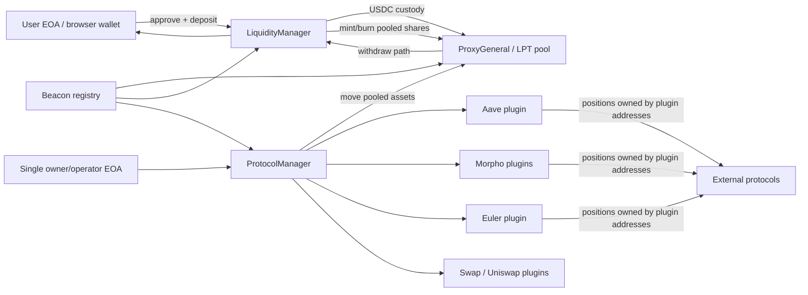
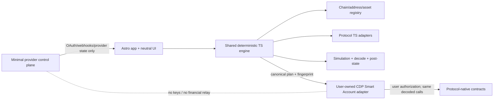

# Jethos software-only refactor: executive audit summary

Audit date: 2026-08-17  
Repository baseline: `dev-26` at `51905af`  
Working tree before audit: clean  
Scope: architecture and migration audit only; no production code, contract, transaction flow, or provider integration was changed.

## Source precedence and evidence labels

The pasted audit directive is the governing instruction. `Jethos_Software_Only_Financial_OS_Master.docx` and `MASTER_CHECKLIST_ALL_MODULES.md` are target hypotheses and planning inputs. Repository code and observable deployment state win when describing the current system.

- **FACT**: observed in source, tests, build output, deployment manifest, or a read-only chain query.
- **INFERENCE**: conclusion from one or more facts; must be validated before irreversible work.
- **EXTERNAL**: provider, commercial, or legal assertion not proven by this repository.

Input provenance (SHA-256): pasted directive `0E7B3CF33C1C1B32441979414041BB39F1E4B774A9EDB7527156119E67A414C4`; target DOCX `017306B41CE262650158E48BBFEC56670712072A4B7389F32BF29123FE521306`; source checklist `B1D41C2EBB6F0423ACD48F3DD6CF912EFEF6960FA46665AD21D99085BFA06E6B`.

## Decision

The current product is a pooled, Jethos-custodied vault system. It is not a client-side compiler for user-owned positions. A user EOA signs `approve/deposit/withdraw`, but funds are transferred into `ProxyGeneral`; `LiquidityManager` mints transferable LPT shares; an owner/operator-controlled `ProtocolManager` moves pooled assets through Jethos plugins; protocol positions belong to plugin contracts. This contradicts target invariants INV-01, INV-05, INV-10, INV-11 and INV-12 at the architectural level.

The target direction is valid only after three corrections:

1. exact-bytes must bind the executable Smart Account/UserOperation envelope, registry version, chain, account, validity window, and simulated state—not only an inner `Call[]`;
2. “software-only” still permits a narrowly bounded non-signing backend for provider secrets, OAuth exchange, and authenticated webhooks; it must never sign, relay protocol orders, or hold an investment ledger;
3. legacy deployed state and permissions require an explicit, evidenced exit/deprecation lane before the pooled path can be removed.

No custom Jethos Solidity component is currently proven `ONCHAIN_REQUIRED` for V1. Protocol-native contracts and the user-owned Smart Account remain on-chain; Jethos-specific middleware defaults to removal or migration-only.

## Current architecture

## Target architecture accepted by this audit

## Decisive repository findings

1. **Custody and pooling are structural.** `ProxyGeneral` is an ERC-20 LPT pool; `LiquidityManager` prices, mints, and burns shares against global NAV.
2. **Protocol positions are not user-owned.** Aave, Morpho, Morpho Vault, and Euler plugins transact for their own contract addresses and return assets to `ProxyGeneral`.
3. **Administrative concentration was observed.** A read-only `latest` inspection of the July 2026 Arbitrum PoC on 2026-08-17 found 21 owner-bearing components controlled by the same EOA. Deposits and withdrawals were enabled.
4. **Observed state was non-zero but is not proven external-user capital.** The same inspection showed 3.1 USDC pool value, 3.1 LPT supply, no net protocol positions, and a sole positive LPT holder equal to the owner/deployer. Its block, RPC identity and literal command were not archived, so it is indicative audit evidence only; `MIG-001` must reproduce a finalized two-RPC snapshot before any mutation. Other deployments/users cannot be ruled out.
5. **`Beacon` is a service locator, not a delegatecall proxy.** No `delegatecall` was found. Repointing the locator does not migrate state.
6. **Useful TypeScript already exists.** `scripts/framework/types.ts` and `plans.ts` define signer-independent serializable plans and dependency validation. They should be split into a shared browser-safe package, not rewritten wholesale.
7. **That framework has API drift.** Its ABI/planner still emits removed `deposit/withdraw` selectors. The scripts suite passes 39/40; the full protocol lifecycle fails on the stale selector.
8. **The live frontend is a static, Arbitrum-only vault UI.** It uses `window.ethereum`, hard-coded deployment metadata, and separate approve/deposit/withdraw calls. It has no CDP/ERC-4337, provider connectors, or exact-bytes invariant.
9. **The repository has no application backend or database.** Provider integrations in the supplied target therefore introduce a new, carefully constrained trust boundary.
10. **Security debt is a release blocker.** The checked-in register has 380 findings (8 critical, 91 high). Confirmed critical examples include partial payout with full share burn, fail-open valuation, and unprotected swap execution.
11. **Product content crosses the target decision boundary.** Strategy presets, target allocations, inferred “health”, and recommendations appear in current scripts/frontend and must not enter the neutral compiler path.
12. **Multi-chain is mostly nominal.** Chain IDs appear in some plan types, but 84 non-document source files reference Arbitrum/42161 and address/asset identity is not consistently keyed by `(chainId,address)`.

## Baseline verification

| Check | Result | Interpretation |
|---|---|---|
| `git status` before work | clean | audit changes isolated |
| root compile | pass; nothing to compile | artifacts available, not proof of correctness |
| scripts typecheck | pass | reusable TS compiles |
| selected Hardhat suites | exploratory run: 371 pass / 21 fail | source/test/ABI drift is real, but the exact nine-file command was not archived; this count is not a reproducible gate |
| scripts framework suites | 39 pass / 1 fail | plan primitives useful; protocol lifecycle stale |
| root `test:unit` | runner fails on Windows glob | CI/local reproducibility defect |
| `jethos-web` check/lint/build | pass | canonical static site is buildable |
| `jethos-web` unit tests | 50/50 pass | non-financial UI/domain base is viable |
| `jethos-web` format | fail in 189 files | existing baseline debt |
| `jethos-web verify` | parity gate fails: missing `dapp-new/assets/brand` | legacy cutover contract is broken |
| Foundry property tests | not run; `forge` unavailable | no pass claim; toolchain gate added |
| read-only Arbitrum checks | `latest` on 2026-08-17; bytecode/state readable; four protocol positions net zero | block/RPC/command not archived; indicative only; migration-grade rerun required |

## Audit metrics

- Meaningful components classified: **56**.
- Classification counts: `KEEP 1`, `KEEP_AND_HARDEN 5`, `EXTRACT_TO_CLIENT 1`, `EXTRACT_TO_SHARED_TS 8`, `REPLACE_WITH_DIRECT_PROTOCOL_CALL 6`, `SPLIT 20`, `REMOVE 8`, `MIGRATION_ONLY 7`, `ONCHAIN_REQUIRED 0`.
- Source checklist: **228 unique tasks**, all initially unchecked; 202 incorrectly declared no dependency.
- Review disposition: **218 source tasks revised** (200 retained IDs plus 18 split originals) and 10 removed; splits produced 47 atomic replacements. Of the 200 retained IDs, 10 received core wording/priority corrections and all 200 received changed dependencies/normalized evidence metadata.
- Repository-specific additions: 31. Revised executable total: **278** tasks: 208 pending, 58 directly blocked and 12 completed audit tasks.

## Recommended first milestone

Complete **M0/M1-L — Reproducible safety and immediate legacy containment** before building a financial feature: approve architecture/trust/executable-envelope/package boundaries; decide the canonical frontend; fix the legacy ABI/test-runner baseline; capture a finalized two-RPC state/allowance/code snapshot; fork-prove a zero-loss holder runbook; then freeze new pooled ingress/allocation without waiting for CDP or Aave. Send CDP/provider evidence requests and prepare the signer-free engine in parallel; the user-owned CDP+Aave exact-envelope slice is the next target milestone.

## Gate

The implementation plan is defined, but Phase 1 financial-path implementation must not begin while the canonical UserOperation binding, frontend/backend boundary, live-state disposition, and reproducible safety baseline remain unresolved. The formal gate is in `21_PRE_IMPLEMENTATION_GATE_REVIEW.md`.
