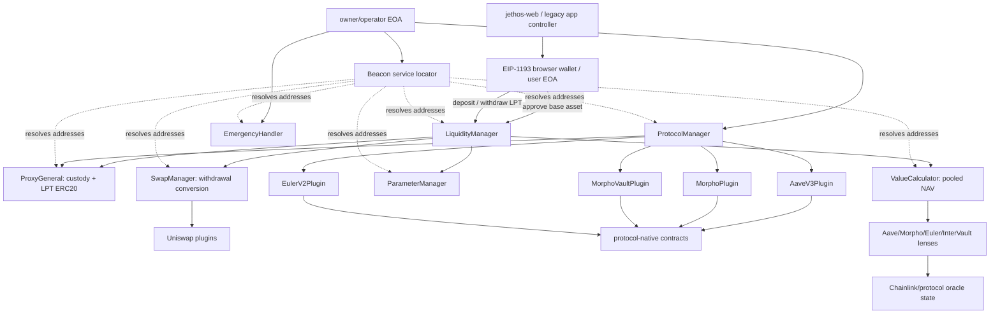
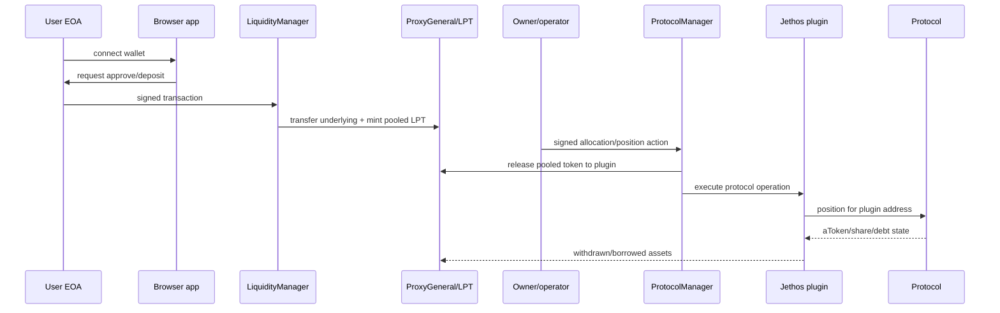
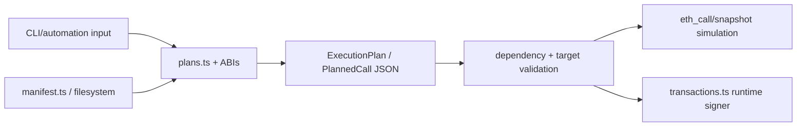

# Current architecture

## Contract relationship graph

## Component roles and authority

| Component | Role | State/custody | Authority and call surface |
|---|---|---|---|
| `ProxyGeneral` | custody, share accounting, module treasury | holds ERC-20s; global LPT balances/supply; authorized modules | owner configures modules/rates/pause; modules move assets |
| `LiquidityManager` | user ingress/egress, share pricing, fee/limit logic | no durable primary custody; mutates LPT and pool balances | public deposit/withdraw; relies on global managers |
| `ProtocolManager` | owner/operator orchestration | protocol activation/selector allowlists | owner/operator supplies, withdraws, borrows, repays; owner-only low-level plugin call |
| `Beacon` | mutable service locator | name→address, history, freeze flags | owner changes registered implementation addresses; no delegatecall |
| `ParameterManager` | global policy/config | fees, limits, pause and parameter proposals | owner/operator paths; known timelock/proposal defects |
| `TokenManager` | token metadata/activation | global symbol-code registry | owner-controlled identity and oracle references |
| `ValueCalculator` | pooled NAV and health | mostly reads; cached/configured dependencies | fail-open/partial valuation can influence deposits, withdrawals, emergency |
| `SwapManager` | pooled asset conversion | allowances, stats, plugin config | modules/owner paths; external DEX calls and broad approvals |
| `EmergencyHandler` | system pause/unwind coordination | emergency status/config | owner-driven; dependent on interfaces and plugin semantics |
| protocol plugins | custody-side execution adapters | positions and approvals held by plugin addresses | callable through managers; protocol-specific callbacks/emergency methods |
| registries/lenses | protocol metadata and reads | market/config lists; calculated positions | mostly owner-configured; some formulas unsafe or stale |

Every major stateful Jethos contract inherits `Ownable` directly or is controlled through an owner-configured registry/manager. No custom proxy upgrade pattern was found. The deployment pattern is replace-and-repoint through `Beacon`, leaving old state and balances in the old address.

## User, signing, and execution planes

The user signs browser transactions. That fact does not make the system non-custodial: after deposit, the user owns a claim token and the Jethos contracts/plugins own the underlying protocol positions.

The operator action is global, not per-user. `scripts/automation` can calculate and, if enabled, execute or propose global allocation changes. Its checked-in mode is disabled/observe-only, but capability—not configuration alone—defines the future attack/trust surface.

## Frontend architecture

`jethos-web/src/pages/app.astro` boots `src/features/app/legacy/controller.js`. Infrastructure and `web3` modules provide:

- EIP-1193 wallet connect/switch/sign;
- a hard-coded chain `42161` deployment;
- public RPC reads of pooled NAV, LPT, USDC, and protocol summaries;
- separate approve, deposit, and withdraw transaction constructors;
- UI estimates constructed independently from signed calldata.

There is no canonical plan object crossing read, preview, simulation, decode, and signature. The user is shown an estimate, then asked to sign independently constructed calls. No backend signer/relay exists in the live app, but the destination is the custodial pooled architecture.

## Existing plan architecture

The non-UI script framework is more aligned to the target than the app:

The split boundary is clear: keep plan shape, deterministic encoding, validation, and simulation concepts; remove Node filesystem and Hardhat signer dependencies from the user path; replace stale Jethos-manager ABIs with direct protocol adapters.

## Upgrade, pause, and recovery implications

- `Beacon` freeze prevents a registry entry change; it does not protect balances in already registered modules from every authorized path.
- `ProtocolManager` has known pause-bypass behavior.
- Plugin emergency/unwind semantics are inconsistent and in some cases swallow failures.
- Repointing a module can strand state and does not revoke old allowances or authorizations.
- User exit depends on Jethos contracts, owner configuration, valuation, and available pool liquidity. It is not independent exitability.

These properties require a migration lane even if the final target deletes all Jethos financial contracts from the normal path.
