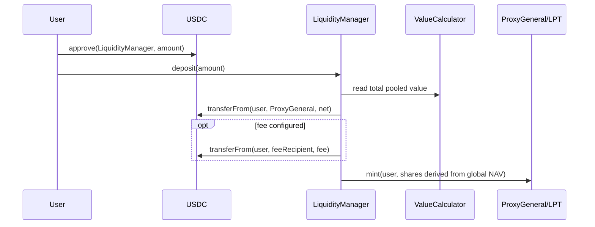
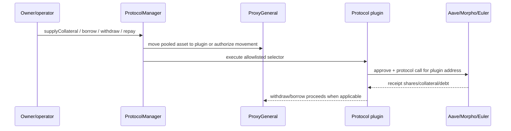
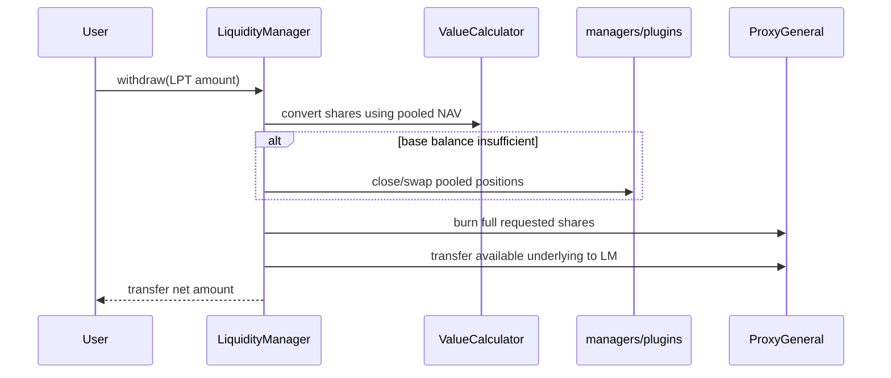
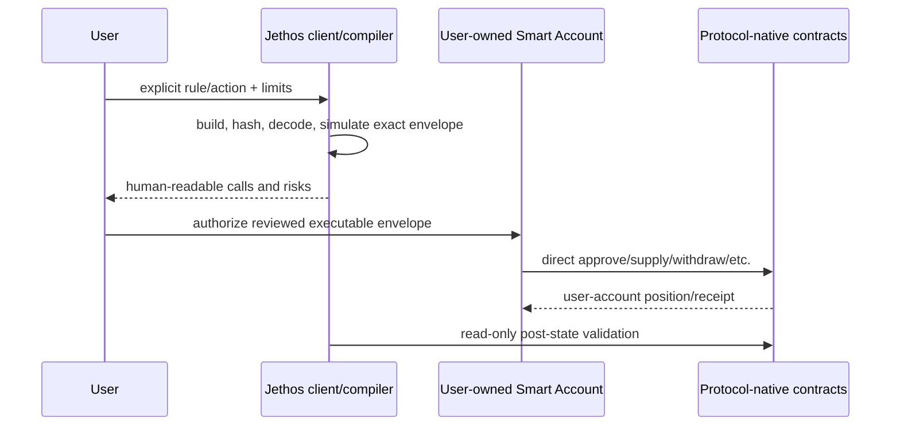

# Current transaction and fund flows

## Authority matrix

| Flow | Signer | Funds before | Funds/position after | Who can move/affect them | Pooled? | Builder location |
|---|---|---|---|---|---|---|
| connect/read | user controls EOA; no tx | user/Proxy/protocol state | unchanged | RPC/provider can affect availability | reads pooled state | browser readers |
| approve USDC | user EOA | user | user; allowance to `LiquidityManager` | user revokes; LM can spend approved amount | no, until deposit | browser |
| deposit | user EOA | user USDC | USDC in `ProxyGeneral`; user LPT | LM, authorized modules, owner-configured system | yes | browser calldata |
| pooled supply | owner/operator EOA | `ProxyGeneral` | plugin-owned protocol position | owner/operator, plugin, protocol, registries | yes | Node/Hardhat scripts |
| pooled borrow/repay | owner/operator EOA | Proxy/plugin/protocol | global plugin debt/collateral | owner/operator and protocol | yes | scripts/automation |
| swap | manager/module or privileged route | Proxy/plugin | Proxy/plugin after DEX | configured plugin, DEX, admin approvals | yes | Solidity manager |
| withdraw | user EOA | user LPT + global pool | user receives underlying; LPT burned | LM may auto-unwind/swap; owner config affects availability | yes | browser calldata |
| automation | configured runtime signer or Safe proposal | pooled system | global allocation/positions | strategy config + executor/Safe signers | yes | Node process |

## Deposit flow

Custody changes at the token transfer. The user no longer holds the underlying or a protocol-native position; the user holds LPT against a global pool. Price/NAV correctness affects shares received. There is no user-supplied minimum shares-out protection in the current path, and the security register identifies first-depositor and donation/sandwich issues.

## Allocation/protocol flow

The plugin is the protocol account. User identity is absent from the position. Even if an operator uses a multisig/Safe, that remains administrative control over pooled positions, not a user-owned Smart Account.

## Withdrawal flow and loss mode

Confirmed finding `CORE-003` shows that the implementation can clamp `netWithdraw` to available base-asset balance while still burning the full requested shares. This is a direct economic-loss blocker. Other exit risks are partial/fail-open valuation, inconsistent plugin close semantics, and privileged/pause state.

## Swap and approval flows

`SwapManager` selects a configured plugin and grants broad approvals. The security register records missing received-balance enforcement, manipulable spot quotes, permanent maximum approvals, and multiple direct Uniswap paths with `amountOutMin=0` or no meaningful price limit. These paths must not be ported as-is. The useful invariant is balance-delta and slippage validation; execution moves to a direct DEX call built for the user account.

## Automation and recommendation flow

The checked-in automation config is observe-only and execution-disabled. Code nevertheless supports:

1. reading global pooled state;
2. comparing it with fixed target basis points;
3. producing global allocation actions;
4. executing with a runtime signer or proposing a Safe transaction.

The target V1 may reuse observation, deterministic thresholds, and notification plumbing only after configuration is explicitly user-owned. Direct execution, backend/operator signing, global allocation, and personalized recommendation language are removed from the user flow.

## Target fund-flow delta

The replacement flow must be:

No asset, pool share, protocol position, user signature, or order crosses a Jethos-controlled financial account or backend. Provider-control-plane calls are separate from protocol execution.
