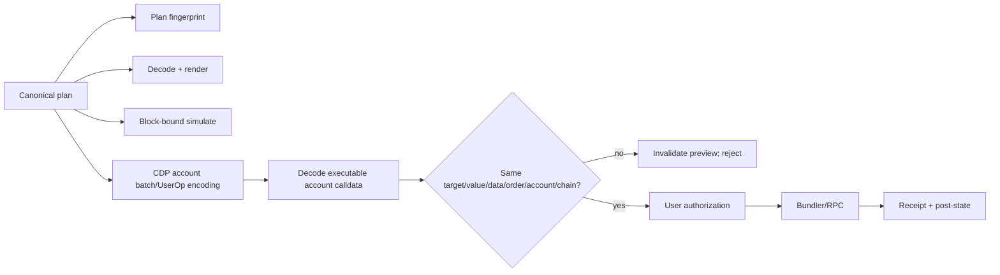

# Wallet and Smart Account gap

## Current capability

| Capability | Current state | Evidence/impact |
|---|---|---|
| wallet connect | EIP-1193 `window.ethereum` | reusable browser session pattern |
| signing | Ethers `BrowserProvider.getSigner()`; EOA-style send | user signs, but only vault calls |
| user account model | one connected address | no `ChainAccount`, recovery, account kind or ownership metadata |
| batching | none in live app | approve/deposit are separate; no atomic plan |
| ERC-4337/UserOperation | absent | no entry point/bundler lifecycle, account calldata proof or ERC-1271 test |
| CDP wallet | absent | no SDK/config/environment/account provisioning |
| session keys/delegation | absent in app | target must prove developer delegation remains off |
| paymaster | absent | V1 scope undecided; secrets/gas policy boundary new |
| recovery/export | EOA wallet responsibility only | CDP disappearance/Jethos disappearance path unproven |
| chain mapping | one Arbitrum address assumed | supplied target requires empirical Arbitrum/Base/Polygon mapping |
| Safe | admin automation/proposal tooling | not evidence of user SA support |

## Reusable abstractions

- connect/disconnect and provider event lifecycle;
- explicit chain-switch request/error handling as a starting point;
- read provider vs signer distinction;
- receipt/event/toast presentation;
- signer-independent `PlannedCall` from the script framework.

The actual send methods, vault ABIs, global address config and EOA assumptions are replaced.

## Required CDP proof, not implementation assumptions

`CDP-001..003`, `CDP-013`, and `AA-001` must produce an empirical evidence bundle for each supported chain:

1. exact CDP product/API/SDK versions and account ownership model;
2. user authentication, idempotent provisioning and re-entry;
3. owner address, Smart Account address and whether addresses differ by chain;
4. developer delegation/server-wallet features absent from the ordinary flow;
5. ERC-1271 and protocol wallet-ownership proof behavior;
6. single call and atomic batch encoding/execution;
7. UserOperation lifecycle, bundler failure/replacement/replay/nonce behavior;
8. recovery/export after Jethos frontend and backend are unavailable;
9. permission/session-key APIs disabled in V1 or bounded by a separate ADR;
10. paymaster mutation/secret/sponsorship policy and user fallback.

## Exact executable handoff

The comparison is semantic and byte-level at each owned layer. Bundler/paymaster-added non-financial fields are classified and constrained; they do not permit changing calls, account, chain, authorization scope or validity.

## EOA and `msg.sender` assumptions to remove

- current Jethos plugins assume their own address is the protocol account;
- legacy app assumes the connected EOA is both owner and direct transaction sender;
- scripts often default to the first Hardhat signer;
- protocol callbacks and Euler EVC context may distinguish account, caller and subaccount;
- provider wallet-link flows may require ERC-1271 instead of ECDSA EOA recovery.

Each direct adapter must specify sender, beneficiary/on-behalf-of, receiver, owner, callback and allowance spender. Tests use a contract account, not only an EOA fixture.

## Session keys and automation

V1 requires explicit user approval for every financial plan. A future session key requires a new ADR and legal/security review defining target allowlist, selectors, maximum value/token/amount, chain, validity, revocation, nonce, condition evaluator and keeper discretion. A generic signer, broad delegation or server-held key violates the target regardless of branding.

## Wallet acceptance gate

No provider/protocol vertical slice is accepted until a user can decode, simulate, authorize, observe and independently recover the same direct-call plan using the intended CDP Smart Account. This is an external/architecture gate, not evidence that CDP is unsuitable.
