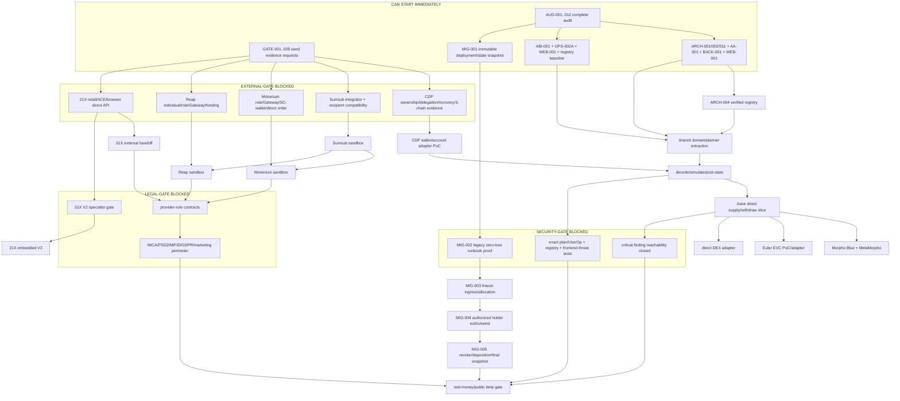

# Revised dependency graph

## Architecture and implementation DAG

## Top implementation dependencies

| Order | Dependency | Blocks |
|---:|---|---|
| 1 | approved trust boundary and invariant ADR | every target package/service/connector |
| 2 | canonical executable-envelope/serialization decision | decode, simulation, CDP handoff, security tests |
| 3 | canonical frontend/package/backend ownership decision | code extraction and connector implementation |
| 4 | reproducible test/ABI baseline | safe reuse and regression evidence |
| 5 | verified chain/address/asset/ABI registry with provenance | every financial read/call |
| 6 | live deployment/state/holder/allowance snapshot | any legacy freeze/removal |
| 7 | CDP owner/delegation/batch/recovery proof | user execution and exitability |
| 8 | shared signer-free planner/simulator boundary | all direct protocol adapters |
| 9 | exact Aave supply/withdraw vertical slice | pattern approval for further DeFi adapters |
| 10 | provider/legal written gates | Sumsub/Monerium/Reap/21X production enablement |

## Gate semantics

- **CAN START IMMEDIATELY:** read-only evidence, ADRs, test repair, pure extraction, request preparation.
- **EXTERNAL-GATE BLOCKED:** acceptance requires written provider capability/credentials/sandbox evidence.
- **LEGAL-GATE BLOCKED:** implementation or enablement changes contractual/regulatory role and awaits qualified review.
- **SECURITY-GATE BLOCKED:** money/state must not move until a named invariant/test/evidence is satisfied.

An external provider gate does not block pure domain/registry/planner work. It does block connector behavior that would encode unconfirmed APIs or roles.

The legacy containment chain `MIG-001 → MIG-002 → MIG-003` depends on the pinned legacy ABI/test baseline, not on the new shared engine, CDP wallet or Aave adapter. Settlement/decommission follows only after separate production authorization and holder coordination; target construction continues in parallel.
